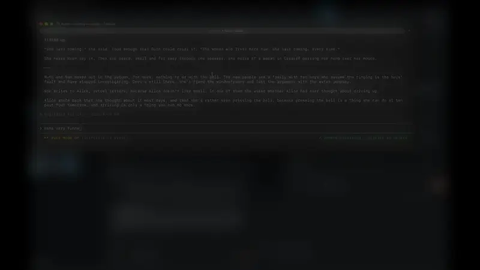

# fastflow

fastflow is a recorder that speeds up through idle periods. Perfect for making demo videos.



Precisely, it records your screen and renders a demo video you can watch without editing. It speeds through the stretches where nobody touched the keyboard or mouse, easing between speeds instead of jumping. A virtual camera frames the window you are working in and blurs the rest. It runs as a menu bar app with a `fastflow` CLI speaking the same socket.

## More information

See [ARCHITECTURE.md](ARCHITECTURE.md) for how it fits together, [docs/v0_design.md](docs/v0_design.md) for the design and [docs/shortcuts.md](docs/shortcuts.md) for every hotkey and command.

## Install

fastflow is built from source on the Mac that runs it. It needs macOS 12.3 or later, Rust with edition 2024 and ffmpeg for rendering.

```sh
brew install ffmpeg
git clone <repo> fastflow && cd fastflow
fastflow_ui_macos/bundle/bundle.sh --install      # builds, signs ad-hoc, installs /Applications/fastflow.app
cargo install --path fastflow_cli                 # the fastflow command
open /Applications/fastflow.app
```

On first launch a setup window asks for Screen Recording and Input Monitoring. Grant both and click **Restart fastflow**. An ad-hoc build needs the grants again after every rebuild; set `FASTFLOW_SIGN_IDENTITY` to a code-signing identity to keep them.

## What to reach for

| You want to | Use |
|---|---|
| Record | the menu bar item, ⌃⌥⌘R or `fastflow start` / `fastflow stop` |
| Get the finished video | nothing: stopping queues a render to `render.mp4`, with a notification when it is done |
| Keep a slow stretch at full speed | ⌃⌥⌘K at its start and end while recording |
| Skip quickly past a detour | ⌃⌥⌘X at its start and end while recording |
| Change pacing, camera or blur | `config.toml` in the recording folder, then `fastflow render <id>` |
| Try settings quickly | `fastflow preview <id>`, a half-size render from the proxy in seconds |
| See why the output looks the way it does | `fastflow diagram <id>` |
| Check what the camera saw | `fastflow render <dir> --boxes` |
| Share a clip as an animated GIF or WebP | Make GIF… in the menu bar. `fastflow gif <id>` from a script |
| Keep a recording's raw footage past 7 days | `fastflow pin <id>` |

Recordings live in `~/Movies/fastflow/<timestamp>/`. The app log is `~/Library/Logs/fastflow/fastflow.log`.

## Status

Working on macOS: ScreenCaptureKit capture, pacing with eased speed ramps, the window-following camera, focus blur, Mission Control handling, marker hotkeys, crash recovery, retention, proxies and previews. Following the cursor across several displays is built and awaits testing on real hardware.

Windows and Linux are not started. There is no audio.

## License

MPL 2.0